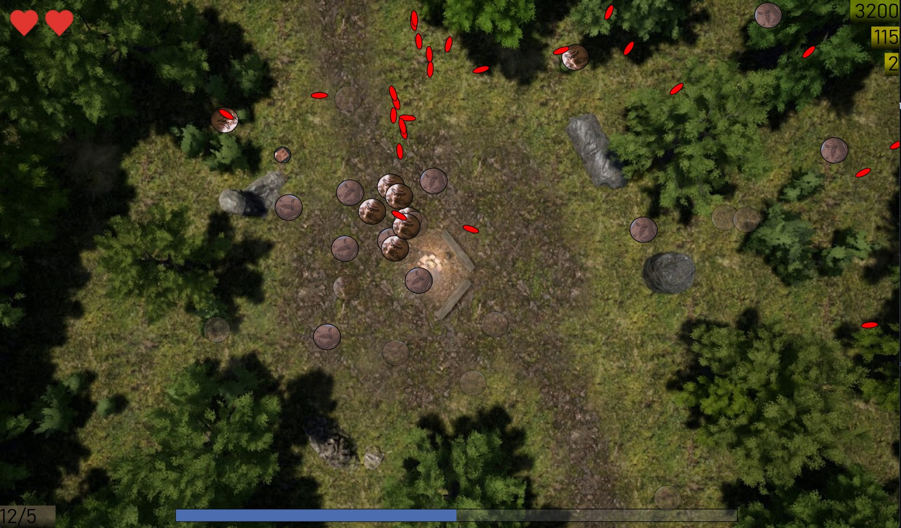
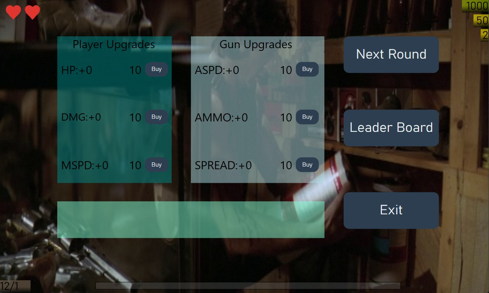

**Mini Rambo - 2D Top View Shooter**

*Made in C# and used WPF XAML.*

**Overview:**
Mini Rambo is an 2D top view shooter game where players control a character and fight with enemies. The game is developed in C# and utilizes WPF XAML for its user interface.

**Features:**
- **Level Up System:** As players progress through the game, they gain points that allow them to but level ups.
- **Score System:** Players can earn points by defeating enemies and completing levels.
- **Increasing Difficulty:** The game becomes progressively harder the longer you play. More enemies appear, and they become more challenging to defeat.
- **Achievements and Leaderboards:** The game includes leaderboards to track and compare high scores with friends and other players.

**Gameplay:**
Players take control of Mini Rambo. The objective is to survive waves of enemies, and achieve the highest score possible. As the game progresses, players must adapt to increasing challenges and strategically utilize their abilities and upgrades.

**Technical Details:**
- **Developed in:** C#
- **User Interface:** WPF XAML

